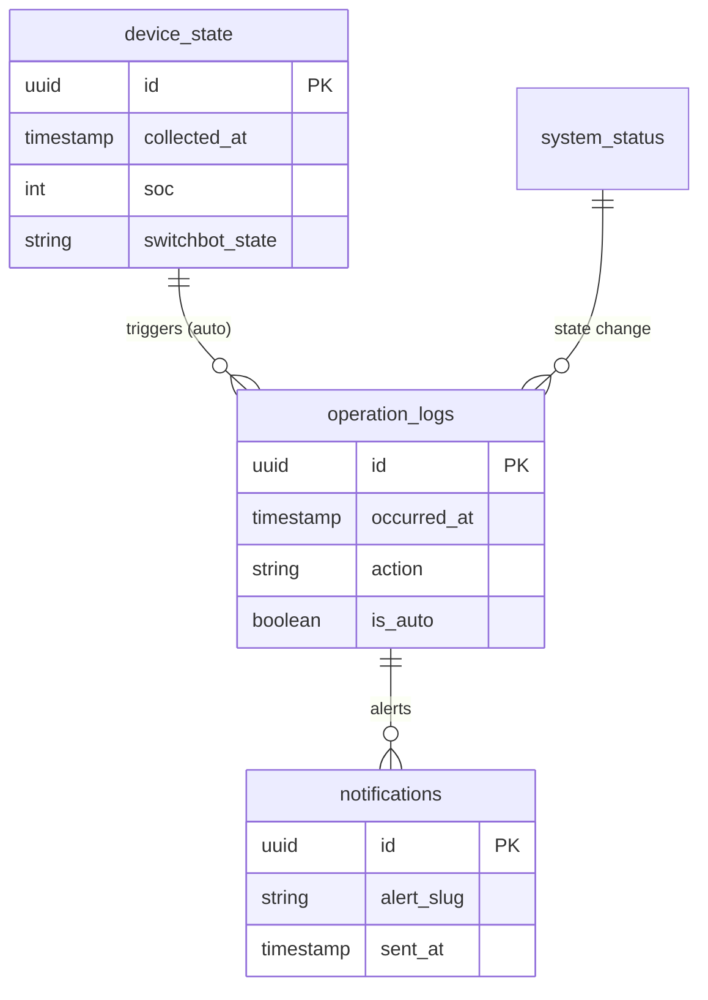

# Database Schema (Vercel Postgres)

This document defines the data structure for the EcoFlow + SwitchBot Monitoring MVP.

## Data Retention Policy
- **High-frequency metrics**: 30 days (summarized after 7 days).
- **Audit/Operation logs**: 365 days.
- **System status**: Single-row persistent state.

## Tables

### `device_state`
Stores snapshots of EcoFlow and SwitchBot status.
- `id`: UUID (Primary Key)
- `collected_at`: TIMESTAMP WITH TIME ZONE (Index: DESC)
- `source`: VARCHAR(50) (e.g., 'ecoflow', 'switchbot')
- `soc`: INTEGER (Current Battery %)
- `watts_in`: INTEGER
- `watts_out`: INTEGER
- `switchbot_state`: VARCHAR(10) ('ON', 'OFF', 'UNKNOWN')
- `raw_payload`: JSONB (Original vendor response)

### `operation_logs`
Audit trail for manual controls and automatic safety actions.
- `id`: UUID (Primary Key)
- `occurred_at`: TIMESTAMP WITH TIME ZONE (Index: DESC)
- `actor_id`: VARCHAR(100) ('system' or User ID)
- `action`: VARCHAR(50) (e.g., 'CHARGE_ON', 'CHARGE_OFF')
- `target`: VARCHAR(50) (e.g., 'switchbot_plug_1')
- `reason`: TEXT (Rationale for the action)
- `is_auto`: BOOLEAN (True if triggered by safety logic)
- `details`: JSONB

### `notifications`
Deduplication and history of alerts.
- `id`: UUID (Primary Key)
- `alert_slug`: VARCHAR(100) (e.g., 'low_soc_35')
- `sent_at`: TIMESTAMP WITH TIME ZONE
- `channel`: VARCHAR(20) ('line', 'email')
- `payload`: JSONB

### `system_status`
Current health of the polling system (Single row).
- `id`: INTEGER (Fixed: 1)
- `last_poll_at`: TIMESTAMP WITH TIME ZONE
- `poll_failure_count`: INTEGER
- `last_success_soc`: INTEGER

## ER Diagram

## Failsafe Flow (DB/API Errors)

> [!IMPORTANT]
> **Safety Priority**: If the database is unreachable or the API fails, the system must default to a "Charging ON" state.

1. **Poll Starts**: Fetch EcoFlow/SwitchBot.
2. **Persistence Check**:
   - If DB Write Fails: Log to stdout, proceed to evaluation in memory.
   - If DB Read Fails (System Status): Assume `poll_failure_count` is increasing.
3. **Safety Evaluation**:
   - If `poll_failure_count` >= 3: Bypass DB, issue `SwitchBot.turnOn()` immediately via API.
   - If API Timeout: Increment local failure counter; if threshold met, force ON.
4. **Recovery**: Once DB/API consistency is restored, log the "Recovery Action" explicitly in `operation_logs`.
